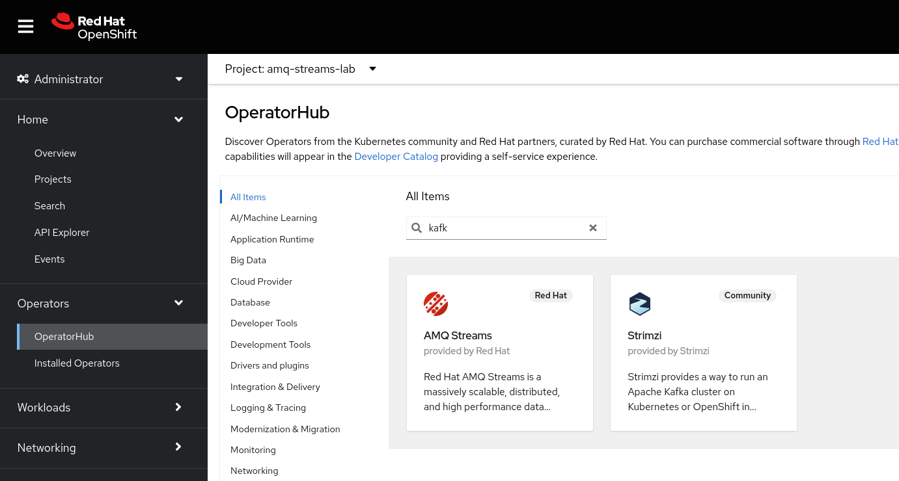
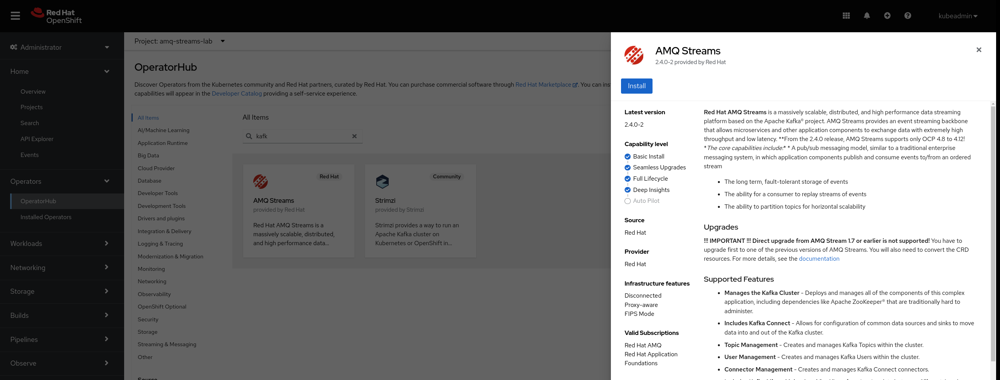
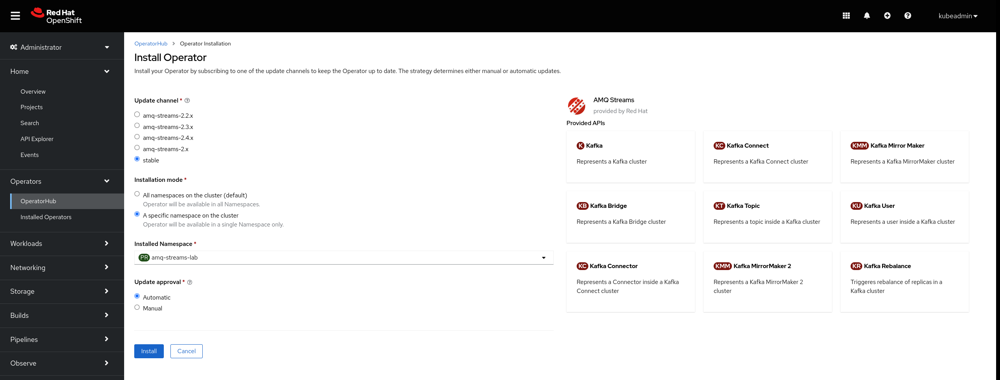
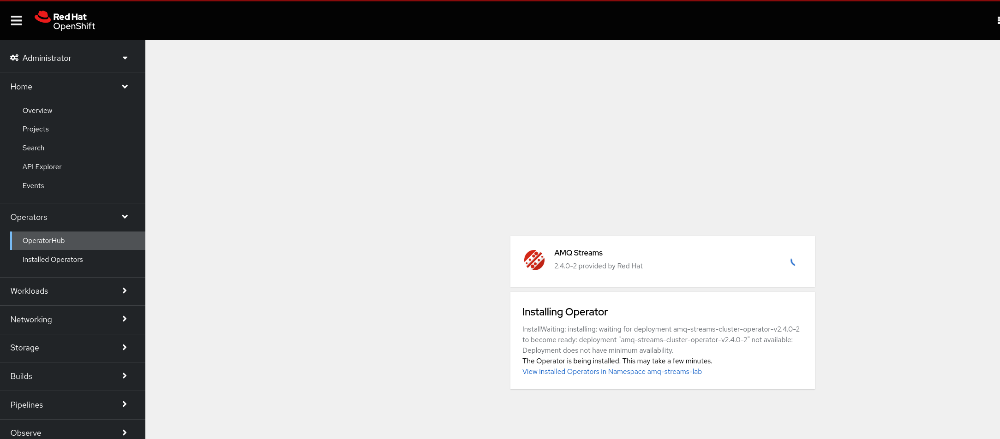
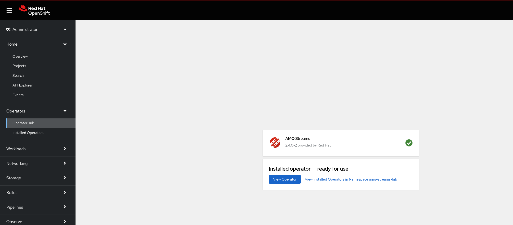
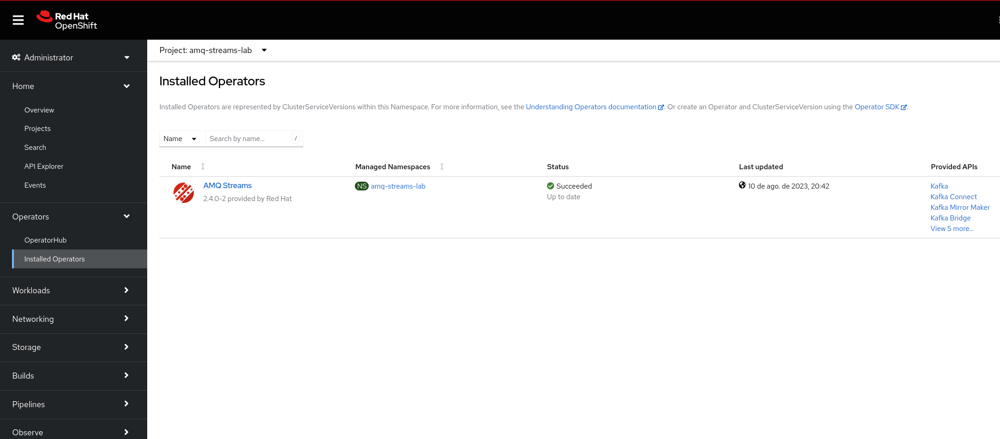
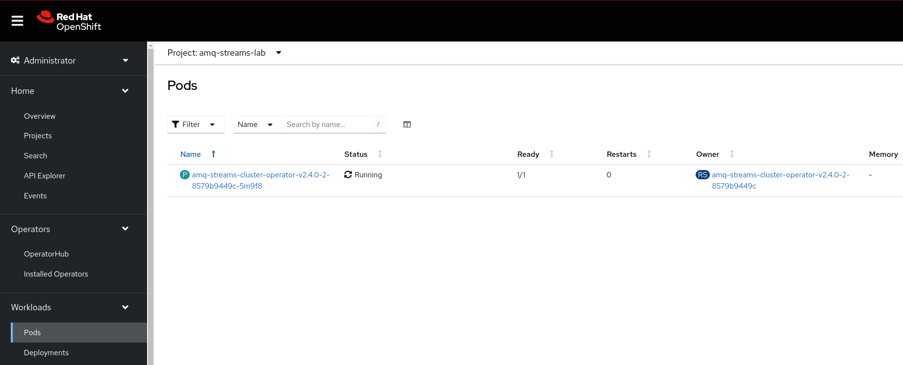

O pré requisito para a instalação do Operator é ser **Cluster-admin**.

Crie uma namespace. Sugerimos para o lab o nome: **amq-streams-lab**

```
oc new-project amq-streams-lab
```

No menu esquerdo do Openshift procure a opção *Operator Hub*



Pesquise a palavra **Kafk** e observe que serão exibidos 2 operators: AMQ Streams e Strimzi. O Strinzi é a versão community do AMQ Streams.

Clique no operator **AMQ Streams** e em Seguida no botão install.



Para o lab selecione a opção **Installed Namespaces** e selecione a namespace desejada. Para fins de lab podemos  aceitar os valores default para as demais propriedades.



Aguarde a finalização da instalação:





Clique no menu esquerdo, na opção **Installed Operators**. observe que o operator ja está instalado



Clique no menu esquerdo na Opçao **Workloads** e na sequência em **pods**. Observe que há um pod do operator em execução.



**Estamos prontos para provisionar um cluster Kafka no Openshift .**

##Considerações

- Não é recomendável instalar o AMQ Streams com o escopo de **All namespaces**, a fim de gerenciar multiplos cluster.
- Não é recomendado a instalar o Operator com a estratégia de atualização automática. Isso pode gerar problemas no cluster causados por alterações feitas no operator.